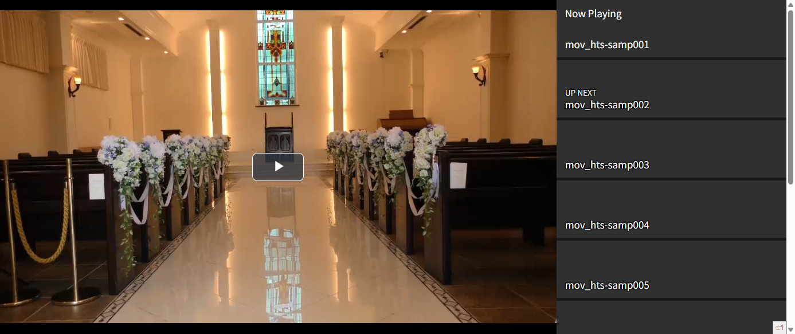

# Simple Video Player



- [video.js](https://videojs.com/)
- [videojs-playlist](https://github.com/videojs/videojs-playlist)
- [videojs-playlist-ui](https://github.com/videojs/videojs-playlist-ui)

Include `player.php` and write code like the follwing:

```php
<?php
require_once '../player.php';
simpleVideoPlayer('videos');
```

Create `videos` directory under the document root and put MP4 files.

Sample videos using in screenshot: https://www.home-movie.biz/free_movie.html

## How to develop

Execute `docker-compose up -d` and put MP4 files to `html/videos/`

## Why PHP 5.5?

Because I need to run on the PHP 5.5 Server.
Also available on the latest PHP.
